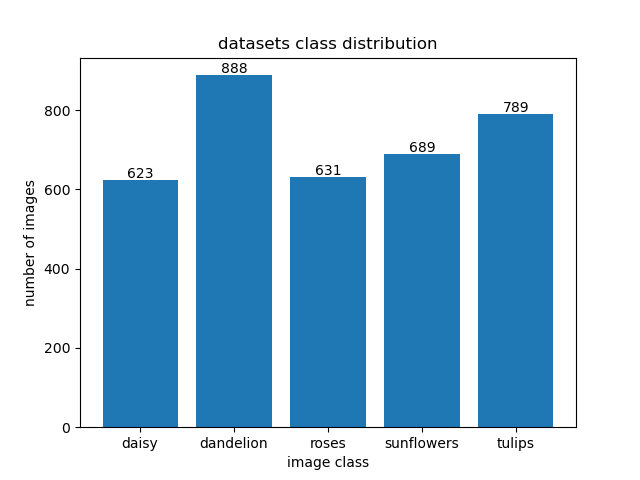
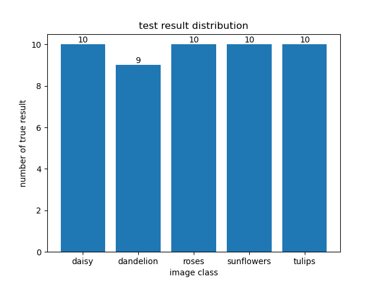

# 手写ViT练习
---
## 项目简介
学习ViT模型后，使用pytorch练习手搓ViT代码，实现图像分类任务，使用5种花的数据集进行训练以及测试，并附上测试结果
## 环境配置
- tensorboard
- tqdm
- torch
- matplotlib
## 项目结构
```
/My_ViT/
    ├── /dataset/                          #数据集（未放入）
        ├── daisy                          #数据类型1
        ├── dandelion                      #数据类型2
        ├── ……     
    ├── /testdata/                         #测试数据集
        ├── daisy                          #数据类型1
        ├── dandelion                      #数据类型2
        ├── ……            
    ├── /pre_weight/                       #预训练权重（未放入）
        ├── vit_base_patch16_224.pth    
    ├── /train/                            #训练结果
        ├── final_model.pth                #仅保存参数（未放入）
        ├── train.png                      #训练截图
        ├── test.png                       #测试截图
    ├── dataset.py                         #数据集构建
    ├── ViT.py                             #ViT模型
    ├── train.py                           #训练
    ├── test.py                            #测试 
    ├── utils.py                           #工具函数
    ├── class_indices.json                 #索引种类映射
    ├── datasets_class_distribution.png    #数据集分布
    ├── test_result.png                    #测试结果
    ├── Readme.md
```
## 使用说明
- 安装相应环境
- 下载数据集和预训练权重放到相应文件夹
- 在train.py最下面设置训练参数后即可运行，生成数据集分布datasets_class_distribution.png，索引种类映射class_indices.json，模型保存在train文件夹的final_model.pth
- 在test.py最下面设置参数后即可运行，测试结果在test_result.png里

---
## 实验
- 数据集构成：
  - 种类数量：5
  - 训练集：验证集 = 8:2
  - 数据集分布图
  - 
- 训练结果图

- 测试
  - 数据集：每个种类10张图，一共50张图
  - 测试结果图

  - 检测错误的测试数据


---
## 代码结构
- ViT.py：实现ViT模型，包括patch操作、Attention机制、Encoder层和初始化权重
- utils.py：工具函数，实现读取数据集以及训练一个epoch操作
- train.py：训练文件，在最下方设置参数以及路径
- test.py：测试文件，在最下方设置参数以及路径
- dataset.py：自定义数据集

---
参考
[博客讲解](https://blog.csdn.net/qq_37541097/article/details/118242600)
[参考代码](https://github.com/WZMIAOMIAO/deep-learning-for-image-processing/tree/master/pytorch_classification/vision_transformer)