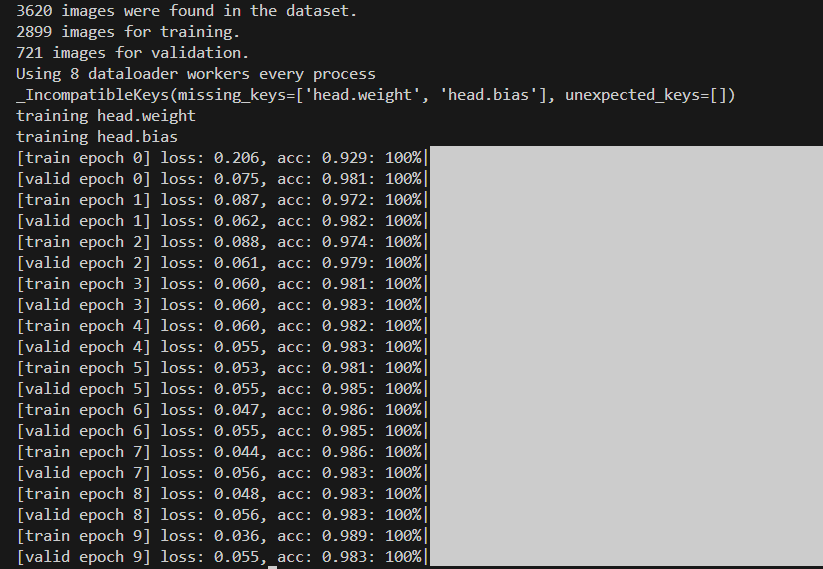

# 手写ViT练习
---
## 项目简介
学习ViT模型后，使用pytorch练习手搓ViT代码，实现图像分类任务，使用5种花的数据集进行训练以及测试，并附上测试结果
## 环境配置
- `tensorboard`
- `tqdm`
- `torch`
- `matplotlib`
## 项目结构
```
/My_ViT/
    ├── /dataset/                          #数据集（未放入）
        ├── daisy                          #数据类型1
        ├── dandelion                      #数据类型2
        ├── ……     
    ├── /testdata/                         #测试数据集
        ├── daisy                          #数据类型1
        ├── dandelion                      #数据类型2
        ├── ……            
    ├── /pre_weight/                       #预训练权重（未放入）
        ├── vit_base_patch16_224.pth    
    ├── /train/                            #训练结果
        ├── final_model.pth                #仅保存参数（未放入）
        ├── train.png                      #训练截图
        ├── test.png                       #测试截图
    ├── dataset.py                         #数据集构建
    ├── ViT.py                             #ViT模型
    ├── train.py                           #训练
    ├── test.py                            #测试 
    ├── utils.py                           #工具函数
    ├── class_indices.json                 #索引种类映射
    ├── datasets_class_distribution.png    #数据集分布
    ├── test_result.png                    #测试结果
    ├── Readme.md
```
## 使用说明
- 安装相应环境
- 下载数据集和预训练权重放到相应文件夹
- 在`train.py`最下面设置训练参数后即可运行，生成数据集分布`datasets_class_distribution.png`和索引种类映射`class_indices.json`，模型保存在`train`文件夹的`final_model.pth`
- 在`test.py`最下面设置参数后即可运行，测试结果在`test_result.png`里

---
## 实验
- 数据集构成：
  - 种类数量：5
  - 训练集：验证集 = 8:2
  - 数据集分布图
  - 
- 训练结果图

- 测试
  - 数据集：每个种类10张图，一共50张图
  - 测试结果图

  - 检测错误的测试数据


---
## 代码结构
- ViT.py：实现ViT模型，包括patch操作、Attention机制、Encoder层和初始化权重
  -  ViT整体结构
  ```python
  class VisionTransformer(nn.Module):
    '''ViT整体'''
    def __init__(self, img_size=224, patch_size=16, in_c=3, 
                 num_classes=6, # 有多少类
                 embed_dim=768, 
                 depth=12, #Block堆叠的个数
                 num_heads=12, 
                 mlp_ratio=4.0, 
                 qkv_bias=True, 
                 qk_scale=None, 
                 representation_size=None, # Pre-logits层的节点个数，ViT中不需要搭建
                 drop_ratio=0, 
                 attn_drop_ratio=0, 
                 embed_layer=PatchEmbed):
        super(VisionTransformer, self).__init__()
        
        # 基础参数设置
        self.num_classes = num_classes
        self.embed_dim = embed_dim
        self.num_features = embed_dim
        self.num_tokens = 1  # CLS token
        
        # 层定义
        norm_layer = partial(nn.LayerNorm, eps=1e-6)  # 创建LayerNorm偏函数
        act_layer = nn.GELU  # 激活函数
        
        # Patch Embedding
        self.patch_embed = embed_layer(img_size=img_size, patch_size=patch_size, 
                                      in_c=in_c, embed_dim=embed_dim)
        num_patches = self.patch_embed.num_patches
        
        # CLS Token和位置编码（可学习参数）
        # 第一个纬度的1是batch_size纬度
        self.cls_token = nn.Parameter(torch.zeros(1, 1, embed_dim))
        self.pos_embed = nn.Parameter(torch.zeros(1, num_patches + self.num_tokens, embed_dim))
        self.pos_drop = nn.Dropout(p=drop_ratio)
        
        # Transformer Blocks堆叠
        self.blocks = nn.Sequential(*[
            Block(dim=embed_dim, num_heads=num_heads, mlp_ratio=mlp_ratio, 
                  qkv_bias=qkv_bias, qk_scale=qk_scale,
                  drop_ratio=drop_ratio, attn_drop_ratio=attn_drop_ratio,
                  norm_layer=norm_layer, act_layer=act_layer)
            for _ in range(depth)  # 堆叠depth个Block
        ])
        
        # 输出层
        self.norm = norm_layer(embed_dim)
        
        # Pre-logits层（可选）
        if representation_size:
            self.has_logits = True
            self.num_features = representation_size
            self.pre_logits = nn.Sequential(OrderedDict([
                ("fc", nn.Linear(embed_dim, representation_size)),
                ("act", nn.Tanh())  # Tanh激活
            ]))
        else: # 默认不做处理
            self.has_logits = False
            self.pre_logits = nn.Identity()  # 恒等映射
        
        # 分类头
        self.head = nn.Linear(self.num_features, num_classes) if num_classes > 0 else nn.Identity()
        
        # 权重初始化
        nn.init.trunc_normal_(self.pos_embed, std=0.02)
        nn.init.trunc_normal_(self.cls_token, std=0.02)
        self.apply(_init_vit_weights)  # 应用自定义初始化
  ```
- utils.py：工具函数，实现读取数据集以及训练一个epoch操作
- train.py：训练文件，在最下方设置参数以及路径
- test.py：测试文件，在最下方设置参数以及路径
- dataset.py：自定义数据集

---
## 参考
- [博客讲解](https://blog.csdn.net/qq_37541097/article/details/118242600)
- [参考代码](https://github.com/WZMIAOMIAO/deep-learning-for-image-processing/tree/master/pytorch_classification/vision_transformer)